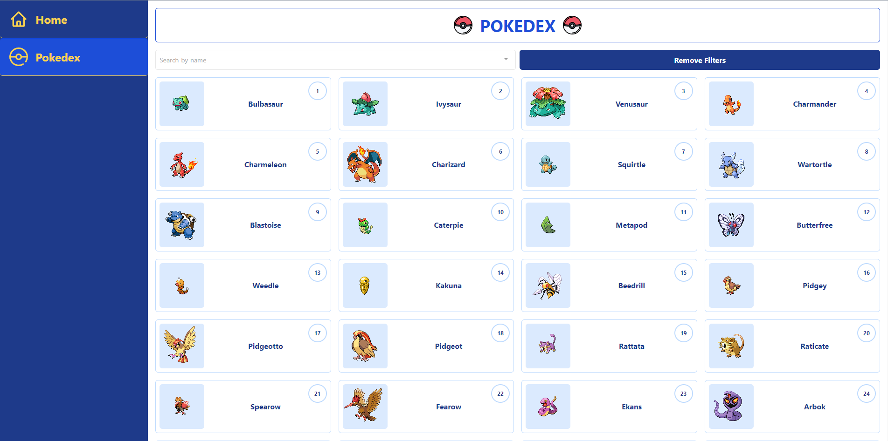
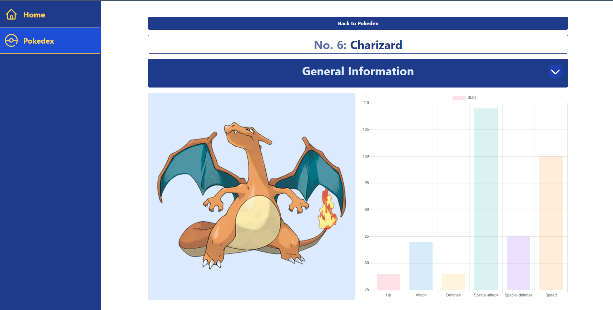

# PokeApiNuxt

# Link: https://pokemon-web-app-alpha.vercel.app/

This is a site created with NuxtJS using the Pokkemon Api. run generate.

## POKEDEX

- You can se a complete Pokedex with te image, number and name of the Pokemon, and click on it.
- Can filter by name.
  

## Pokemon details view

- Yo can see the stats of a Pokemon and a chart with it.
  
